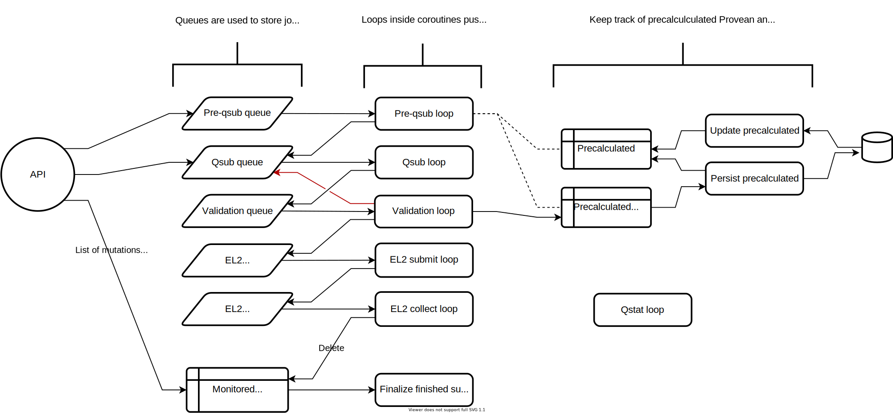

# ELASPIC REST API

[](https://elaspic.gitlab.io/elaspic-rest-api/v0.2.0/)
[](https://gitlab.com/elaspic/elaspic-rest-api/commits/v0.2.0/)
[](https://elaspic.gitlab.io/elaspic-rest-api/v0.2.0/htmlcov/)

## Overview

<p align="center">

</p>

## Development

1. Build an `elaspic-rest-api` conda package.

    ```bash
    conda build .gitlab/conda
    ```

1. Create an `elaspic-rest-api` conda environment using the built package (this will automatically install all dependencies).

    ```bash
    conda create -n elaspic-rest-api --use-local elaspic-rest-api
    ```

1. (Optional) Install source package in development mode.

    ```bash
    conda activate elaspic-rest-api
    pip install -e .
    ```

1. Start the development server.

    ```bash
    conda activate elaspic-rest-api
    uvicorn elaspic_rest_api.app:app --host 0.0.0.0 --port 8000 --reload \
        --log-level=debug --log-config .gitlab/docker/logconfig.ini --env-file .env
    ```

## Deployment

1. Build a Docker image.

    ```bash
    export CONDA_BLD_ARCHIVE_URL="https://gitlab.com/api/v4/projects/3259401/jobs/artifacts/master/download?job=build"

    docker build --build-arg CONDA_BLD_ARCHIVE_URL .gitlab/docker/
    ```

1. Run the built Docker image.

    ```bash
    docker run --tty --env-file .env --env HOST_USER_ID=9284 \
        --env=GUNICORN_CMD_ARGS="--bind 0.0.0.0:8080 --workers 1" \
        --volume /home/kimlab1/database_data/elaspic:/home/kimlab1/database_data/elaspic:rw \
        registry.gitlab.com/elaspic/elaspic-rest-api:latest
    ```
